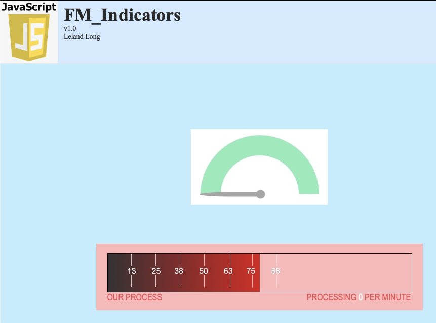

# JS_Indicators

#### A FileMaker Pro training aid

Learn how to create 2 different dashboard indicators (animated graph meters) in FileMaker using JavaScript.

#### Prerequisites

You do need a basic understanding of FileMaker concepts such as Tables, Fields, Layouts, and Scripts.

#### Usage

1. Download and open the zipped Filemaker Pro database

2. Read the first section, then move to the next one in the Layouts drop-down menu

3. Several scripts are available for further exploration of this topic

#### Dependancies

This database uses no additional dependancies. One JS library will be used but will be locally stored.
